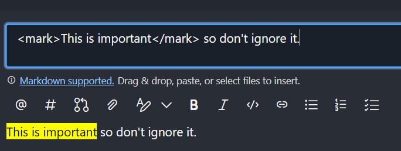

# Highlight text in markdown

I just learned that you can highlight text in PR descriptions and comments on Azure devops by using the `<mark>` element in your markdown:

`<mark>Notice this!</mark>`

I don't think I was even aware of the [`mark` html element](https://developer.mozilla.org/en-US/docs/Web/HTML/Element/mark) even though it's been around for a while now.
