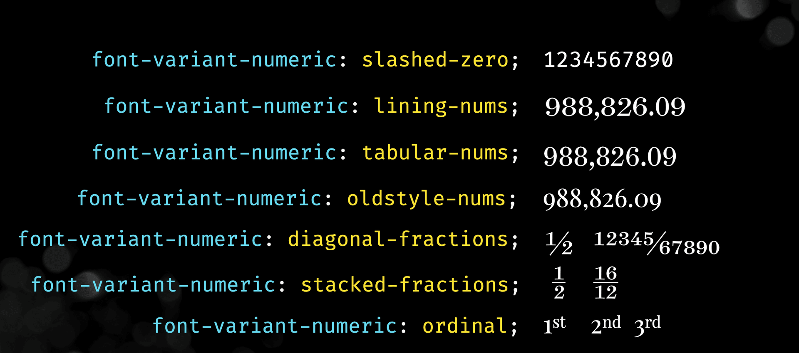

# font-variant-numeric

Today I learned about the `font-variant-numeric` CSS property that lets you control alternate glyphs for numbers.

Not every font will support all of these but the `tabular-nums` option is common and seems especially useful for data in grids.

[Using Font Variant Numeric]( https://textlab.dev/posts/font-variant-numeric )