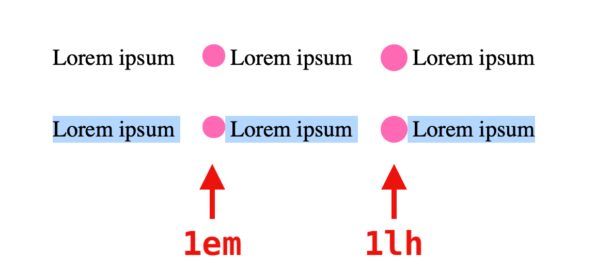

# `lh` and `rlh` units

Today I learned that there are new [line height](https://css-tricks.com/lh-and-rlh-units/) units in CSS.
The `lh` unit is “equal to the computed value of line-height”.

If nothing else this will be nice for a small annoyance I've run into before of vertically centering icons:

