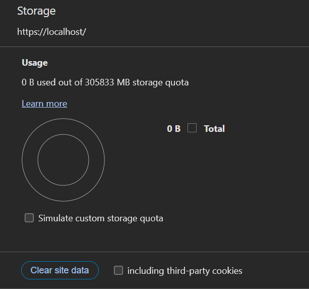
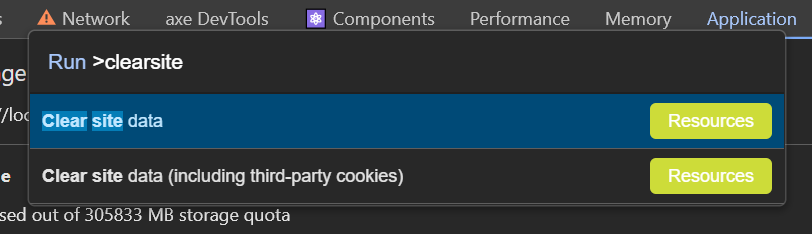

# Clear site data

protip: if you need to clear out some saved data (like cookies) for a particular site, Chrome dev tools has a handy "Clear site data" function.

You can get to it from the "Application" tab:

or from the command palette which you can invoke with `ctrl+shift+p`:

To me this is much more convenient than trying to go through the normal user settings for clearing 

There is also chrome://settings/content/siteDetails?site=https%3A%2F%2Flocalhost