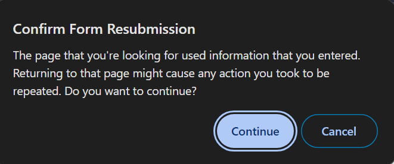

# Chrome devtools ignores form resubmission

Today I learned that if you have the chrome devtools open, then Chrome will suppress the confirm form resubmission dialog:

This threw me off for a minute because I couldn't figure out how the page was maintaining the state when I would refresh after a post.

I couldn't find it documented anywhere but it's a nice convenience during development though it could be confusing if you're unaware of it.