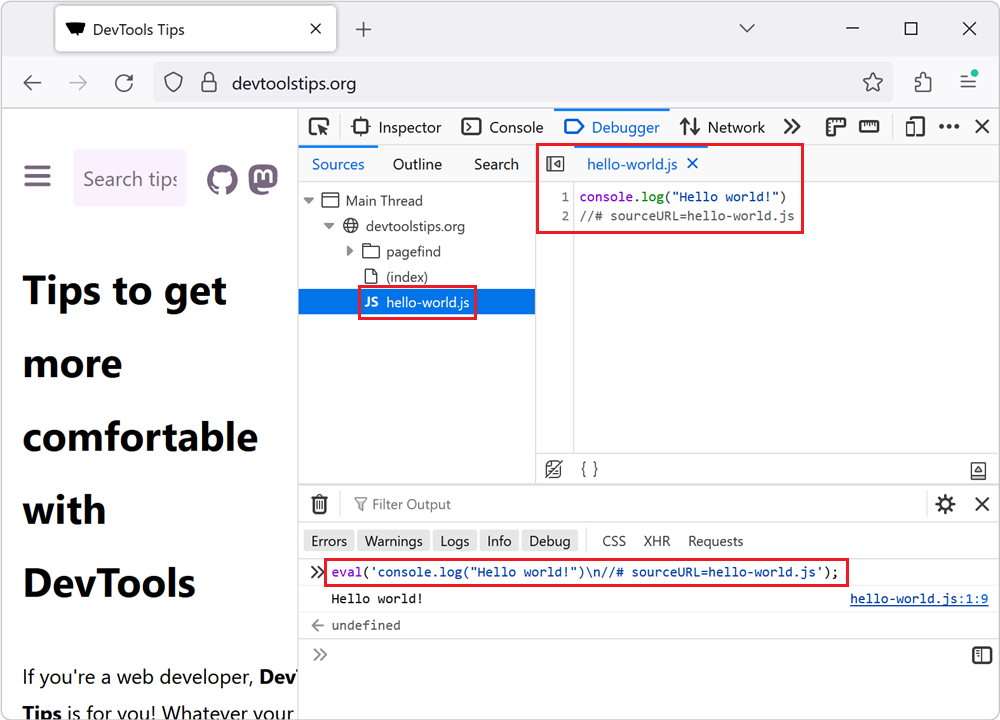

# sourceURL pragma

Today I learned that you can add `//# sourceURL=<anything>.js` special comment to an inline script tag to have it show up as a separate javascript file in the dev tools sources tab.

This makes it a bit easier to work with especially when you have a huge inline script tag you're dealing with.

It even works with `eval()` too if you're unfortunate enough to be dealing with that.

https://devtoolstips.org/tips/en/name-evaluated-files/

