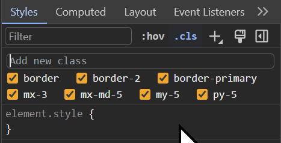

# Toggle CSS classes in Devtools

Today I learned that the little `.cls` button in the Chrome devtools is a handy way to toggle classes on an element:

I imagine the trend of using utility classes was the main motivation for this feature (although apparently it's been there for a few years and I only just figured out what it was for).
