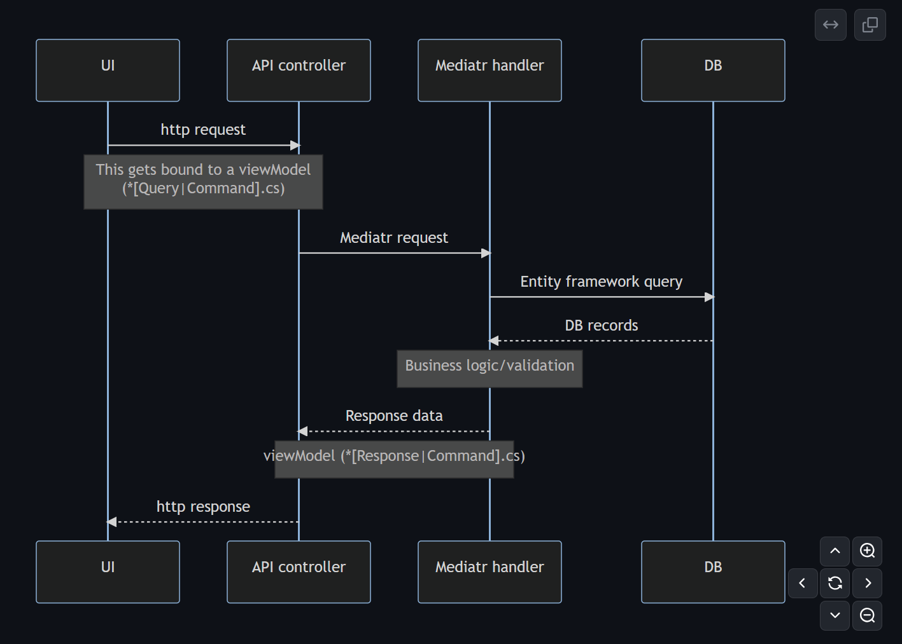

# Sequence Diagrams

I learned how to correctly [read sequence diagrams](https://www.lucidchart.com/pages/uml-sequence-diagram).
I came across a recent post that suggests "[Sequence diagrams are the only good thing UML brought to software development](https://www.mermaidchart.com/blog/posts/sequence-diagrams-the-good-thing-uml-brought-to-software-development)".
I'd never thought they were that useful but it turns out that was because I'd been misreading them.

There's probably been a few instances over the years where I've made a flowchart where a sequence diagram would have been better.
For example, I tend to add a high-level overview of how a request moves through our application especially since [Mermaid.js](https://mermaid.js.org/) makes it really easy to add to markdown documentation ([Github and Azure DevOps](https://github.blog/2022-02-14-include-diagrams-markdown-files-mermaid/) will both render them).

Here's a quick example of a typical [vertical slice architecture](https://github.com/jbogard/ContosoUniversityDotNetCore-Pages) we would use at Headspring.
Adding this code block to a markdown file will render a sequence diagram using Mermaid:

```
  sequenceDiagram
    UI->>api: http request
    participant api as API controller
    Note over UI,api: This gets bound to a viewModel <br/>(*[Query|Command].cs)
    participant mediatr as Mediatr handler
    api->>mediatr: Mediatr request
    mediatr->>DB: Entity framework query
    DB-->>mediatr: DB records
    Note over mediatr: Business logic/validation
    mediatr-->>api: Response data
    Note over api,mediatr: viewModel (*[Response|Command].cs)
    api-->>UI: http response
```

Rendered on Github:


