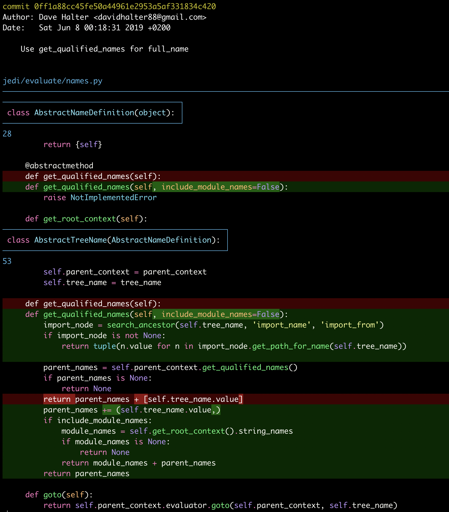

# Delta pager for Git

Today I learned that you can configure git to use a different diff viewer when displaying diffs from the command line.
You do this by setting the `pager` config `git config --global core.pager delta` and [delta](https://github.com/dandavison/delta) is a cool one written in Rust that can even display line numbers and syntax highlighting.

`git show` produces:

Relatedly, it uses the same themes as [bat](https://github.com/sharkdp/bat/) which is a `cat` command line replacement with syntax highlighting that is pretty nice.