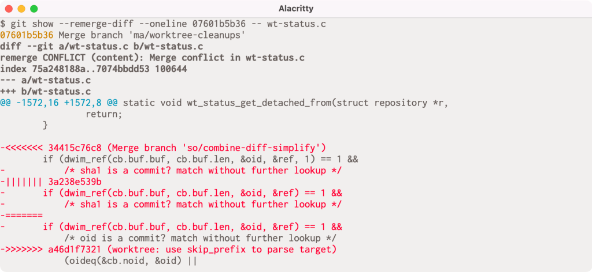

# View the conflicts resolved in a merge commit

Today I learned that [in Git 2.36](https://github.blog/2022-04-18-highlights-from-git-2-36/#review-merge-conflict-resolution-with-remerge-diff), the `--remerge-diff` option was added to `git show`.
This effectively lets you view any merge conflicts that occurred during a merge commit and how they were resolved.

So for instance, `git show --remerge-diff <commit-message-id>` would show something like:

Under the hood, it recreates the merge with the conflicts and diffs it with the merge commit so the conflict markers are shown in red since the merge commit removes the conflict markers during resolution.

