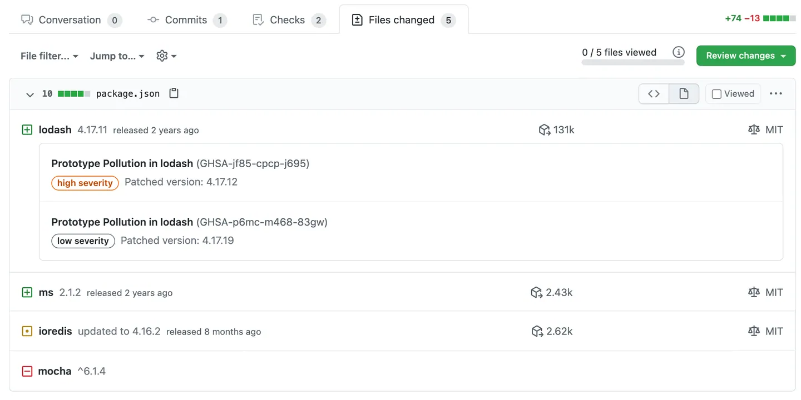

# Dependency Review

#til that Github has a cool [dependency review](https://docs.github.com/en/pull-requests/collaborating-with-pull-requests/reviewing-changes-in-pull-requests/reviewing-dependency-changes-in-a-pull-request) feature for pull requests.

If a dependency file like a `package.json` or `.csproj` has been modified, you can click on the "rich diff" button and it will list out any dependencies that changed or any vulnerabilities for those versions. It'll even list out sub-dependencies in a `package-lock.json` which is otherwise pretty inscrutable.

