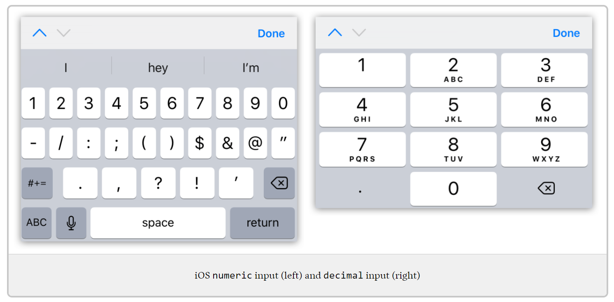
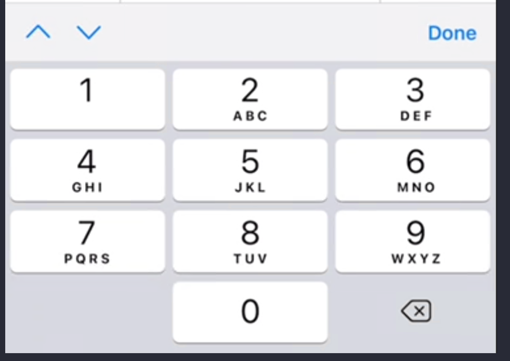
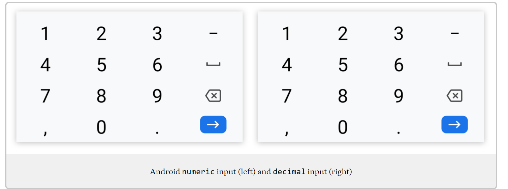

# Input modes

#til that iOS changed the way it handles the `inputmode="numeric"` attribute on HTML input elements.

It used to display the full number keyboard as shown here:

I couldn't find it documented anywhere but, after testing various versions on BrowserStack, I found that starting with iOS 14 the `numeric` keyboard is the same as `decimal` but without the decimal key:

This is overall an improvement in usability I think except if you need to allow the user to enter negative numbers. So something to be aware of since I couldn't find any way to type the `-` with that attribute set.

Unfortunately, all the sites I found that discuss inputmodes, show the old version like [this post](https://css-tricks.com/better-form-inputs-for-better-mobile-user-experiences/) but it's still a good resource and I recommend setting an inputmode where it makes to make it easier to type certain values on mobile devices.

Also, I like how Android handles it better:

