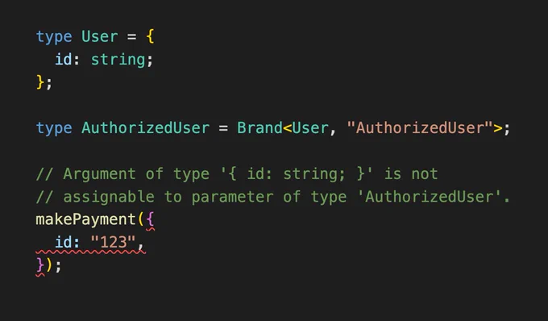

# Nominal types in Typescript

Today I learned about a pattern in Typescript called "Branded Types" which lets you create "nominal" types.

Typescript's type system is structural which is incredibly flexible and powerful when working with javascript patterns, but occasionally you want to add some extra strictness where even if the shape of the data is the same, you'll get a type error if the _name_ of the types don't match (like in C# which is a _nominal_ type system).

A simple example looks like this:

Read more here: [https://egghead.io/blog/using-branded-types-in-typescript](https://egghead.io/blog/using-branded-types-in-typescript)