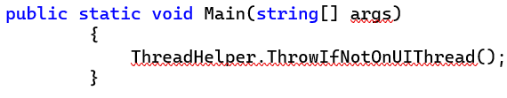

# Copy Nice Extension

Today I learned about a handy little Visual Studio extension called [Copy Nice](https://marketplace.visualstudio.com/items?itemName=MadsKristensen.CopyNice) whose sole purpose is to address an annoyance I encounter frequently where the indentation is off when I copy and paste code snippets.

With this extension, when code is copied it will automatically be formatted to take care of the leading indentation issue.

Now if only there was some system-level utility to this do when copying from anywhere...
