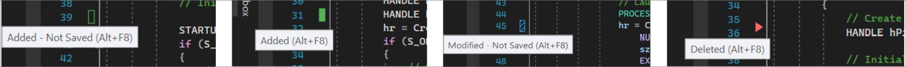

# Visual Studio 2022 can stage individual lines in git

Visual Studio added support for staging to commit individual chunks of changes (also known as interactive staging).
This essentially lets you commit only parts of the changes you've made to a file or easily undo those changes.
This is probably my most-used feature in a git gui client.

One caveat, it took me a minute to figure out how to use it in VS because if you have an external diff tool configured in git then clicking to view the diff in VS will open that tool instead of the VS diff viewer.
But you can also stage lines by clicking on the margin annotations:

**Bonus TIL**: I now know exactly what these indicators mean.

See https://learn.microsoft.com/en-us/visualstudio/version-control/git-line-staging?view=vs-2022
