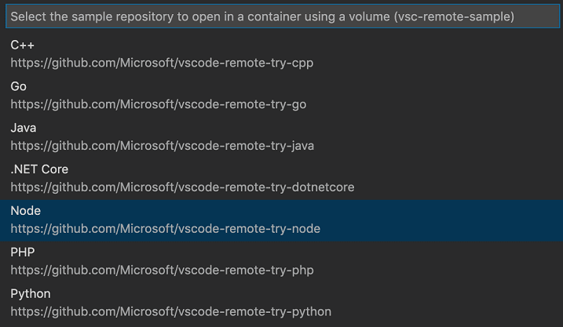

# Dev containers

Today I learned that [dev containers](https://containers.dev/) are an actual spec.
I'd been hearing the term more lately but I thought it was a general term for containers used for local development but it's actually an open spec for configuring an entire development environment within a container and it's what you use to configure a [github codespace](https://github.com/features/codespaces) for a repo.
But the cool thing is you can use the vscode [Dev containers extension](https://marketplace.visualstudio.com/items?itemName=ms-vscode-remote.remote-containers) and vscode will reopen in a docker container with all the dependencies, extensions, and configuration specified in a [devcontainers.json](https://containers.dev/implementors/spec/#devcontainerjson).

For example, if you want to experiment with a new programming language, you can quickly launch one of the sample containers (type "try" from the command palette) and have an environment ready to go (after docker downloads the image).

