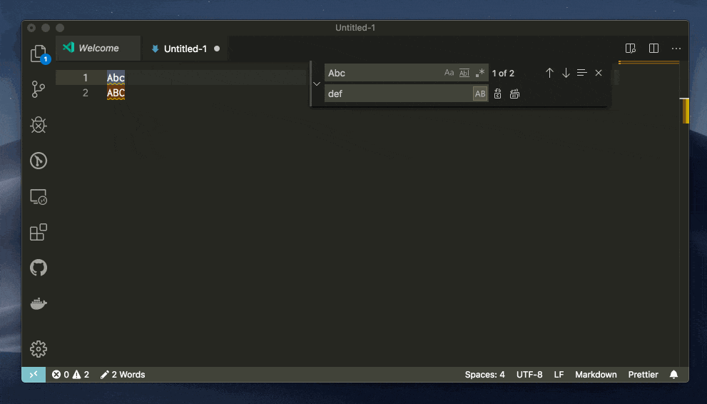

# Preserve case with find and replace

Today I learned that vscode has an option to [preserve case with find and replace](https://code.visualstudio.com/updates/v1_37#_preserve-case-in-find-and-replace) (I somehow never noticed the "AB" button before).
I've always wanted this when having to rename an entity in a file with instances both capitalized and lowercase.

I actually discovered this because I saw that this feature was just added to the latest [Visual Studio 2022 preview](https://devblogs.microsoft.com/visualstudio/keep-your-casing-with-case-preserving-find-and-replace/)

And for vim users, there's [Vim Abolish](https://github.com/tpope/vim-abolish) 😁