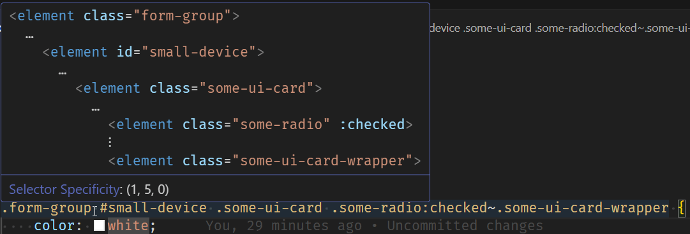

# VS code can show the required HTML structure for a CSS selector

If you hover over a CSS selector or property, [VS Code](https://code.visualstudio.com/docs/languages/css) will provide an HTML snippet that's matched by the CSS rule, and it will also show the specificity.

For example, this very specific rule that's similar to one I came across recently:

I also had to look up the `~` which is the [General sibling combinator](https://developer.mozilla.org/en-US/docs/Web/CSS/General_sibling_combinator).

