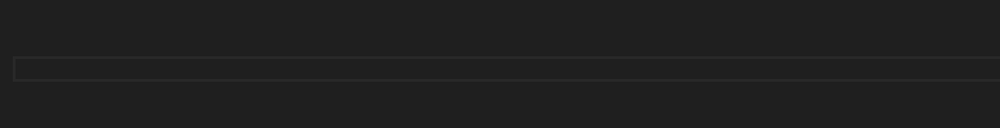

# Paste a URL as a markdown link

Today I learned that the latest version of VS code added a smart option to detect when you're pasting a URL and automatically paste it as a markdown link in markdown files.

You can enable it by setting the `markdown.editor.pasteUrlAsFormattedLink` setting to `smart` or `always`.

[See the release notes.](https://code.visualstudio.com/updates/v1_81#_markdown-paste-urls-as-formatted-links)

